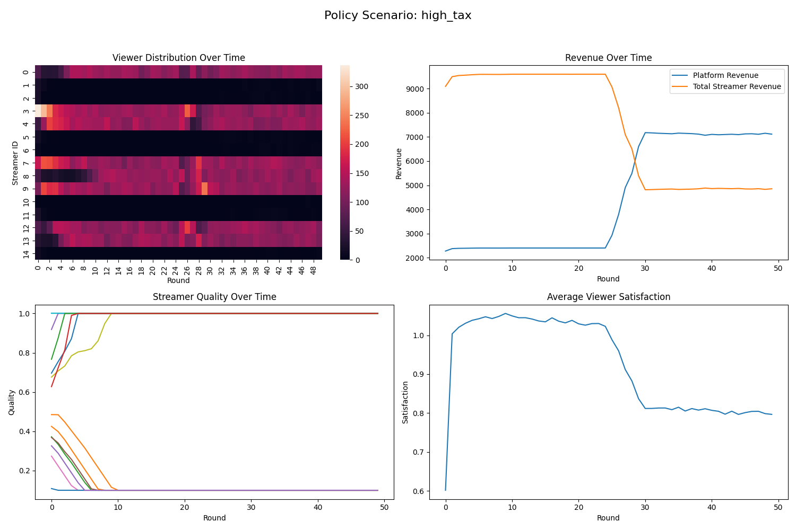

# Exploring-the-Head-Effect-in-Live-Streaming-Platforms-A-Two-Sided-Market-and-Welfare-Analysis
Exploring the Head Effect in Live Streaming Platforms: A Two-Sided Market and Welfare Analysis


```TEXT
live-stream-sim/
├── agents/
│   ├── broadcaster.py    # 主播模型
│   └── viewer.py         # 观众模型
├── platform/
│   ├── policy_engine.py  # 政策干预模块
│   └── recommendation.py # 推荐算法
├── simulation/
│   ├── core.py           # 核心模拟引擎
│   ├── metrics.py        # 指标计算
│   └── config_loader.py  # 配置加载
├── analysis/
│   ├── visualize.py      # 可视化模块
│   └── reporter.py       # 报告生成
├── experiments/
│   ├── comparative.py    # 对比实验
│   └── sensitivity.py    # 敏感性分析
├── configs/
│   └── base.yaml         # 基础配置
└── utils/
    └── economics.py      # 经济指标工具
```

```bash
pip install -r requirements.txt
python experiments/comparative.py
python experiments/sensitivity.py --param network_effect_beta --range 0.1 0.2 --steps 5
python analysis/reporter.py --input results/exp1/ --output report/
```

# Exploring the Head Effect in Live Streaming Platforms: A Two-Sided Market and Welfare Analysis [Open View Link](https://openreview.net/forum?id=0YVYjiKbVt&filter=excludedInvitations%3AKDD.org%2F2025%2FADS_Track_February%2FSubmission58%2F-%2FChat&nesting=3&sort=date-desc)

## 1. Project Overview
This project is dedicated to the research on the head effect in live - streaming platforms. By constructing a simulation model, it delves into network effects, viewer selection mechanisms, and the impacts of platform policy interventions.

## 2. Experimental Objectives
- Verify the spontaneous formation of the head effect in a simulated environment.
- Evaluate the effects of different platform intervention policies on traffic concentration and social welfare.
- Validate whether viewers' comprehensive reactions to live - streaming content quality, streamer popularity, and platform recommendations are consistent with the assumptions in the theoretical model.

## 3. Experimental Design
The experiment adopts a "multi - stage, mixed - method" design. It involves generating "streamer accounts" and "viewer accounts", setting different platform policies and recommendation algorithms for control and intervention groups, recording key metrics during multi - round live - streaming interactions, and comparing differences between groups.

For a more detailed experimental framework, please refer to the following figure:


## 4. Experimental Results
The following table presents the key metrics under different scenarios:

| Scenario | gini_coefficient | top_3_share | viewer_mobility | tail_share | avg_satisfaction | quality_improvement |
|---|---|---|---|---|---|---|
| baseline | 0.555733 | 0.459 | 6.688435 | 0.541 | 0.98926 | - 0.134414 |
| high_tax | 0.4816 | 0.4 | 9.548299 | 0.6 | 0.796576 | - 0.02299 |
| boost_small | 0.3188 | 0.319 | 12.165986 | 0.681 | 2.123171 | - 0.035645 |
| combined | 0.2636 | 0.301 | 18.82449 | 0.699 | 1.753325 | 0.096633 | 

From the table, we can observe that different scenarios lead to varying results. For example, the "baseline" scenario shows a relatively high Gini coefficient, indicating a certain degree of viewer concentration. In contrast, the "combined" scenario has the lowest Gini coefficient, suggesting that the combined policies are effective in reducing viewer concentration and promoting a more balanced distribution of traffic.

In addition to the table, the following pictures further illustrate the experimental results:
<div style="display: flex; justify-content: center;">
    
    
    
    
</div>

These pictures provide a more intuitive understanding of the changes in various metrics over different scenarios, such as the evolution of viewer distribution, revenue trends, and quality changes.

## 5. Project Structure
```
live - stream - sim/
├── agents/
│   ├── broadcaster.py    # Streamer model
│   └── viewer.py         # Viewer model
├── platform/
│   ├── policy_engine.py  # Policy intervention module
│   └── recommendation.py # Recommendation algorithm
├── simulation/
│   ├── core.py           # Core simulation engine
│   ├── metrics.py        # Metric calculation
│   ├── config_loader.py  # Configuration loading
├── analysis/
│   ├── visualize.py      # Visualization module
│   └── reporter.py       # Report generation
├── experiments/
│   ├── comparative.py    # Comparative experiments
│   └── sensitivity.py    # Sensitivity analysis
├── configs/
│   └── base.yaml         # Basic configuration
└── utils/
    └── economics.py      # Economic metric tools
```

## 6. Usage
1. **Install Dependencies**: Execute the following command in the project root directory to install the required Python libraries:
```bash
pip install -r requirements.txt
```
2. **Run Basic Experiments**: Execute the following command in the project root directory to run the comparative experiments:
```bash
python experiments/comparative.py
```
3. **Perform Sensitivity Analysis**: Execute the following command in the project root directory to conduct sensitivity analysis. For example, to analyze the `network_effect_beta` parameter in the range from `0.1` to `0.2` with 5 steps:
```bash
python experiments/sensitivity.py --param network_effect_beta --range 0.1 0.2 --steps 5
```
4. **Generate Visual Reports**: Execute the following command in the project root directory to generate reports based on simulation results. Assume the simulation results are stored in the `results/exp1/` directory and the report is output to the `report/` directory:
```bash
python analysis/reporter.py --input results/exp1/ --output report/
```

## 7. Contribution Guidelines
We welcome community members to contribute to the improvement and expansion of this project. If you have any suggestions or want to contribute code, please follow these steps:
1. Fork this repository to your personal account.
2. Create a new branch in your forked repository to implement your features or fix issues.
3. Make code modifications and ensure that necessary test cases are added.
4. Submit your Pull Request and describe your changes and purposes in detail.

## 8. Contact Information
If you encounter any problems or have any questions during use, please contact us:
- **Email**: [your_email@example.com](mailto:your_email@example.com)
- **GitHub Discussion Area**: [Link to the project's discussion area](https://github.com/yourusername/yourproject/discussions)